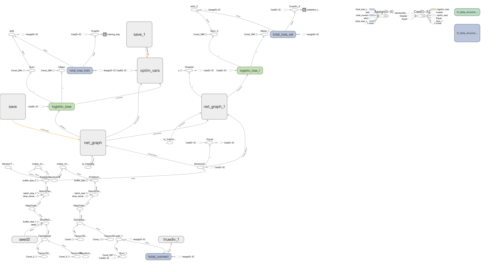
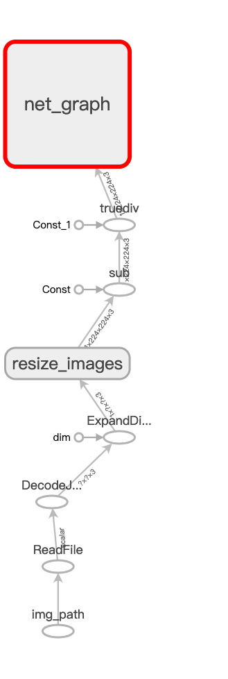

# Cat-recognition-train
This repository demonstrates how to train a cat vs dog recognition model and export the model to an optimized frozen graph easy for deployment using TensorFlow.

## Requirements
- Python3 (Tested on 3.6.8)
- TensorFlow (Tested on 1.12.0)
- NumPy (Tested on 1.15.1)
- tqdm (Tested on 4.29.1)
- Dogs vs. Cats dataset from [https://www.kaggle.com/c/dogs-vs-cats](https://www.kaggle.com/c/dogs-vs-cats)
- (Optional if you want to run tests) PyTorch (Tested on 1.0.0 and 1.0.1)

## Build environment
We recommend using Anaconda3 / Miniconda3 to manage your python environment.

If the machine you're using does not have a GPU instance, you can just:
```
$ pip install -r requirements.txt
```
or,
```
$ conda install --file requirements.txt
```

However, if you want to use GPU to accelerate the training process, please visit [https://www.tensorflow.org/install/gpu](https://www.tensorflow.org/install/gpu) for more information.

## Train a Convoluational Neural Network

In this part, we will use [TensorFlow](https://github.com/tensorflow/tensorflow) to train a CNN to classify cats' images from dogs' image
using Kaggle dataset [Dogs vs. Cats](https://www.kaggle.com/c/dogs-vs-cats/data). We will do the following things:
- Create training/valid set (dataset.py)
- Load, augment, resize and normalize the images using `tensorflow.data.Dataset` api. (dataset.py)
- Define a CNN model (net.py)
    * Here we use the [ShufflenetV2 structure](https://arxiv.org/abs/1807.11164), which achieves great balance between speed and accuracy.
    * We do transfer learning on ShuffleNetV2 using the pretrained weights from [https://github.com/ericsun99/Shufflenet-v2-Pytorch](https://github.com/ericsun99/Shufflenet-v2-Pytorch).
    * If you want to know how to load PyTorch weights onto TensorFlow model graph, please check `convert_pytorch_weight_test` starting from line 44 in `module_tests.py`.
- Train the CNN model (train.py)
- Serialize the model for deployment (train.py)

If you want to execute the code, make sure you have all package requirements installed, and Dogs vs. Cats training dataset placed in `datasets`. The folder structure should be like:

```
cat-recognition-train
+-- train.py
+-- net.py
+-- dataset.py
+-- datasets
    +-- train
    |   +-- cat.0.jpg
    |   +-- cat.1.jpg
    |   ...
    |   +-- cat.12499.jpg
    |   +-- dog.0.jpg
    |   +-- dog.1.jpg
    |   ...
    |   +-- dog.12499.jpg
+-- ...
```

After all requirements set, run the following command using default arguments:
```
$ python train.py
```

Or you can pass your desired arguments:
```
$ python train.py --epochs 30 --batch_size 32 --valset_ratio .1 --optim sgd --lr_decay_step 10
```
See `train.py` for available arguments.

## Visualizing Learning using Tensorboard
During training, you can supervise how is the training going by running:
```
$ tensorboard --logdir runs
```
And you can check the tensorboard summaries on `localhost:6006`.

### Training Flow

<p align="center">
  
  <caption>Whole training flow, including CNN model and other training operations like optimizer, saver, etc</caption>
</p>

### Model Performance

<p align="center">
  
  <caption>Validation/Train loss and validation accuracy on each epoch</caption>
</p>


### Optimized Network Graph

<p align="center">
  
  <caption>Optimized Network Graph</caption>
</p>
