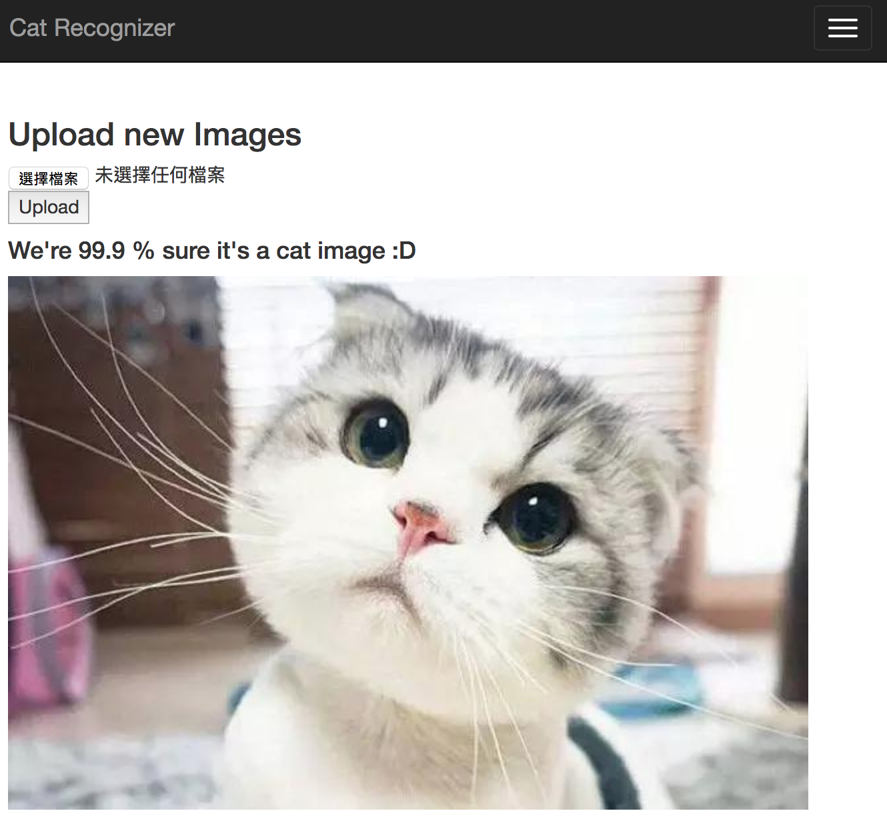
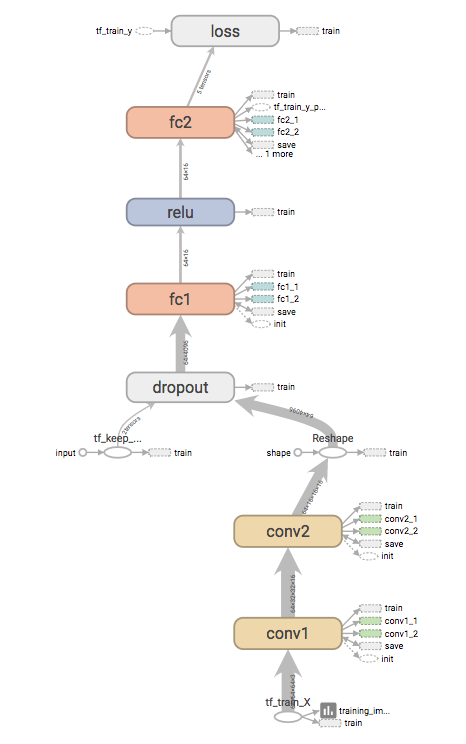
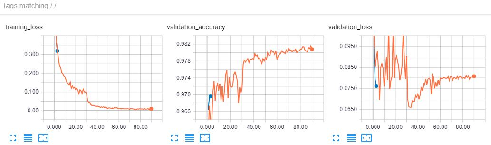
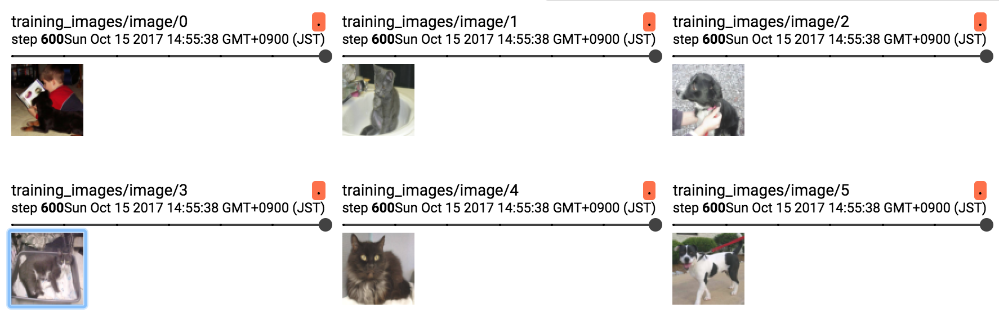

# Cat-recognition-app
A flask app showcasing how to recognize cats using Tensorflow.

This repository contain all the necessary python code required to build a production-ready ML application that able to identify cats in image.

## Demo on [Heroku](https://damp-anchorage-60936.herokuapp.com/)

It may take some time to boot the heroku app because we have lots of dependencies.  
The application is devided into two parts, left panel for uploading image for recognizing cats / dogs and the right panel act as gallery.

<p align="center">
  <a href="https://damp-anchorage-60936.herokuapp.com/" target="_blank"></a>
</p>


## Background
Although there are lots of good tutorials telling you how to build a machine learning model,
we feel that there is little explanation about how to actually deploy your model as a web application.


So we decided to build a simple image classifier
that is able to recognize cats and deploy it in order to simulate(or at least practice)
how to actually deploy a ML model in real world.

We will also use [TensorBoard](https://www.tensorflow.org/get_started/summaries_and_tensorboard) to visualize how our model is learning to gain more insight.


## Table of contents
- Build environment (on mac)
- Train a Convolutional Neural Network as image classifier
- Visualizing Learning using Tensorboard
- Build a Flask application
    * Allow users upload images
    * Make predictions using trained model
- Deploy the application on Heroku


## Build environment (on mac)
We will use python 3.6 and [pyenv](https://github.com/pyenv/pyenv) to management our environment.
```commandline
pyenv install 3.6.1
```

Create a new virtual environment to manage dependencies
and use the env under current project folder.
```commandline
pyenv virtualenv 3.6.1 py3.6-ml-app
cd cat-recognition-app/
pyenv local py3.6-ml-app
```

Install dependencies for training models and visualization.
We will train our models using TensorFlow on jupyter notebook.
```commandline
pip install numpy tensorflow jupyter scipy pillow matplotlib seaborn jupyter_contrib_nbextensions ipywidgets
```

## Train a Convoluational Neural Network

In this part, we will use [TensorFlow](https://github.com/tensorflow/tensorflow) to train a CNN to classify cats' images from dogs' image
using Kaggle dataset [Dogs vs. Cats](https://www.kaggle.com/c/dogs-vs-cats/data). We will do the following things:
- Load, resize and normalize the images
- Create training/valid set
- Train a CNN model
- Serialize the model for later deployment

All steps described above will be included in the jupyter notebook [cat_recognizer](cat_recognizer.ipynb).
If you want to execute the code in the notebook, install all the extra dependencies.

```commandline
jupyter nbextension enable --py widgetsnbextension
```

Start a jupyter server:

```commandline
jupyter notebook
```

And you should be able to open and run the notebook at localhost:8888.

## Visualizing Learning using Tensorboard

When training the model defined in the [cat_recognizer](cat_recognizer.ipynb), in addition to the reported accuracy messages showed in the notebook, you may be wondering:
- how do our neural network look like?
- what kind of images do we actually put into the model?
- do model improve during training?

These questions can be answered or better understood by viewing [Tensorboard](https://www.tensorflow.org/get_started/summaries_and_tensorboard). To open the tensorboard for this repo, enter:

```commandline
tensorboard --logdir=/tmp/tensorboard/cat-recognizer/
```

And you should be able to see all the interesting things on `localhost:6006`:

### Neural Network structure

As shown below, our simple neural network consist of two conv layers, followed by
one fully-connected layer (fc1) and the output layer (fc2) with single neuron.
In order to prevent overfitting, there is also a dropout mechnism between conv layer
and fully-connected layer.

<p align="center">
  
</p>

Notice here for the sake of clarity, some nodes (e.g. save, evaluation) are
removed so that only the training nodes remains. You may see a more complex
compuation graph on Tensorboard.

### Model Performance

<p align="center">
  
  <caption>Accuracy and loss of trained model on Tensorboard</caption>
</p>


### Some images used for Training

<p align="center">
  
  <caption>Images used in a mini-batch</caption>
</p>


## Build a Flask application

In this part, we will build a simple flask web application which allow users
to upload images and predict whether there are cats in the images using the
model we trained in previous part.

In order to run the app, extra dependencies are needed:
```commandline
pip install flask flask-bootstrap boto3
```

To start the flask application:

```commandline
python app.py
```

And you should be able to view the app at localhost:5000 using the browsers.


## Deploy the application on Heroku

In order to deploy the app on the Heroku, a user account and the [Heroku CLI](https://devcenter.heroku.com/articles/heroku-cli) are required.

To install the Heroku CLI on mac:
```commandline
brew install heroku/brew/heroku
```

Login using your account:
```commandline
heroku login
```

Install the dependencies and setting files:
```commandline
pip install gunicorn
pip freeze > requirements.txt

touch runtime.txt
echo "python-3.6.1" > runtime.txt

touch Procfile
echo "web: gunicorn app:app --log-file=-" > Procfile
```

Create a new Heroku application:
```commandline
heroku create

Creating app... done, ⬢ damp-anchorage-60936
https://damp-anchorage-60936.herokuapp.com/ | https://git.heroku.com/damp-anchorage-60936.git
```

Deploy the application on Heroku. Your application id will be different from ours, which is `damp-anchorage-60936`
```
heroku git:remote -a damp-anchorage-60936
git add .
git commit -m "First commit"
git push heroku master
```

And you should be able to see the application on `https://YOUR-APPLICATION-NUM.herokuapp.com/`.


## Run app on Docker

Enable access to application running on docker @ `localhost:1234`
```commandline
docker run -dp 1234:5000 leemeng/cat
```

Check whether the application is running
```commandline
docker ps
CONTAINER ID        IMAGE               COMMAND             CREATED             STATUS              PORTS                    NAMES
a887934e1849        leemeng/cat         "python3 app.py"    3 minutes ago       Up 3 minutes        0.0.0.0:1234->5000/tcp   thirsty_carson
```

Stop the application
```commandline
docker stop a887934e1849
```

## Trouble Shooting
### [pyenv build fail](https://github.com/pyenv/pyenv/issues/655)

Try install CLI dev tools
```commandline
xcode-select --install
```
### Incompatable ruby version when installing Heroku CLI (MAC)

Update ruby using brew and make it the default ruby
```commandline
brew install rbenv ruby-build

# Add rbenv to bash so that it loads every time you open a terminal
echo 'if which rbenv > /dev/null; then eval "$(rbenv init -)"; fi' >> ~/.bash_profile
source ~/.bash_profile

# Install Ruby
rbenv install 2.4.2
rbenv global 2.4.2
ruby -v
```

## Dependencies

To install all the dependencies listed in [requirements.txt](requirements.txt)
all at once:

```commandline
pip install -r requirements.txt
```
